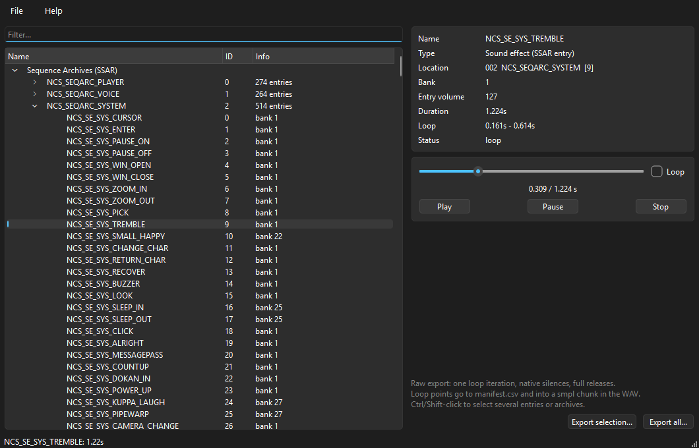
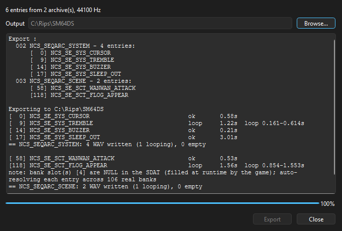

# DualRip

Rips Nintendo DS sound effects (SSAR) and music (SSEQ) inside `sound_data.sdat` to WAV by emulating the DS sound driver. CLI + GUI.

## What you get

- One loop iteration per sound or song, full release envelopes, native rests preserved.
- Loop points in `manifest.csv` and embedded in the WAV as a `smpl` chunk.

## Screenshots

Browse the SDAT, preview entries with the built-in player (seek, pause, loop
on the sound's own loop points):



Batch export with per-entry log, loop points and bank auto-resolution notes:



## Usage

```
dualrip --sdat sound_data.sdat --archive all --out MyRip
dualrip --sdat sound_data.sdat --sequence all --out MyMusic
```

| Option | Effect |
|---|---|
| `--archive N` | rip one SSAR archive, or `all` (default when no `--sequence`) |
| `--sequence N...` | rip these SSEQ music indices, or `all` (into an `SSEQ/` subfolder) |
| `--rate N` | sample rate (default 44100) |
| `--only I J...` | only these entry indices |
| `--bank-map "4=32+33"` | override bank resolution |

GUI: open a `.sdat`, browse/filter, double-click to preview any sound effect
or music track (seek, pause, loop on its own loop points), Ctrl/Shift-select
sound effects, archives or sequences and export.

## Dynamic bank slots

Some games leave bank slots null in the SDAT and fill them at runtime.
DualRip resolves these automatically (family-affinity + coverage ranking).
The resolution shows up in the manifest (`4->33`); `--bank-map` overrides.

## Credits

Core is a Python port of the FeOS Sound System (fincs), via Naram Qashat's
NCSF player ([in_xsf](https://github.com/CyberBotX/in_xsf)). Tables from
Nintendo NNS driver disassembly. Adds two behaviors missing upstream:
note-wait on endless notes (voice chaining) and portamento sweep on tied notes.

## Code

```
dualrip/tables.py, cprims.py   lookup tables, C-semantics primitives
dualrip/formats/               SWAR/SWAV, SBNK, SDAT (only sdat.py touches ndspy)
dualrip/engine/                sequencer, envelopes/synthesis, raw-export policy
dualrip/bankmap.py             static patch scan + auto bank resolution
dualrip/export.py              WAV/manifest, public API: render_one / rip_archive / rip_sequences
dualrip/cli.py, gui/           frontends
```

Deps go one way: GUI → export/bankmap → engine → tables. Nothing outside
`gui/` imports Qt. Golden tests in `tests/test_golden.py` (needs
`DUALRIP_TEST_SDAT` env var) pin the renderer bit-for-bit.

## Requirements

Python ≥ 3.10, `numpy`, `ndspy`, `PySide6`, `sounddevice`. No game data included.

## Build

```
pip install -e .[gui] pyinstaller
pyinstaller dualrip.spec          # dualrip_linux.spec / dualrip_macos.spec elsewhere
```

One-file build, bundles Python, PySide6 and the icon. `build_exe.bat` /
`build_linux.sh` / `build_macos.sh` wrap the same command per platform.
Linux needs `libportaudio2` and the Qt xcb libs installed on the build
machine (see the `apt-get` step in `.github/workflows/release.yml`).
Pre-built binaries for Windows, Linux and macOS are available on the releases page.
