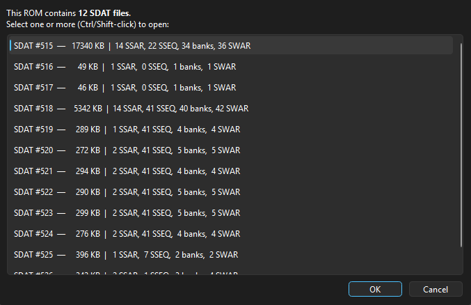
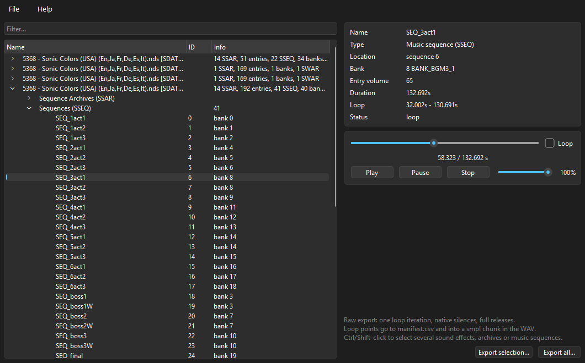
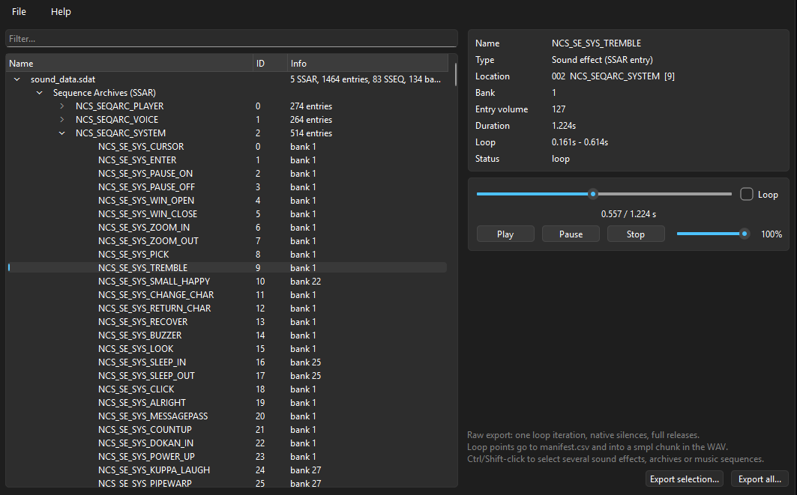
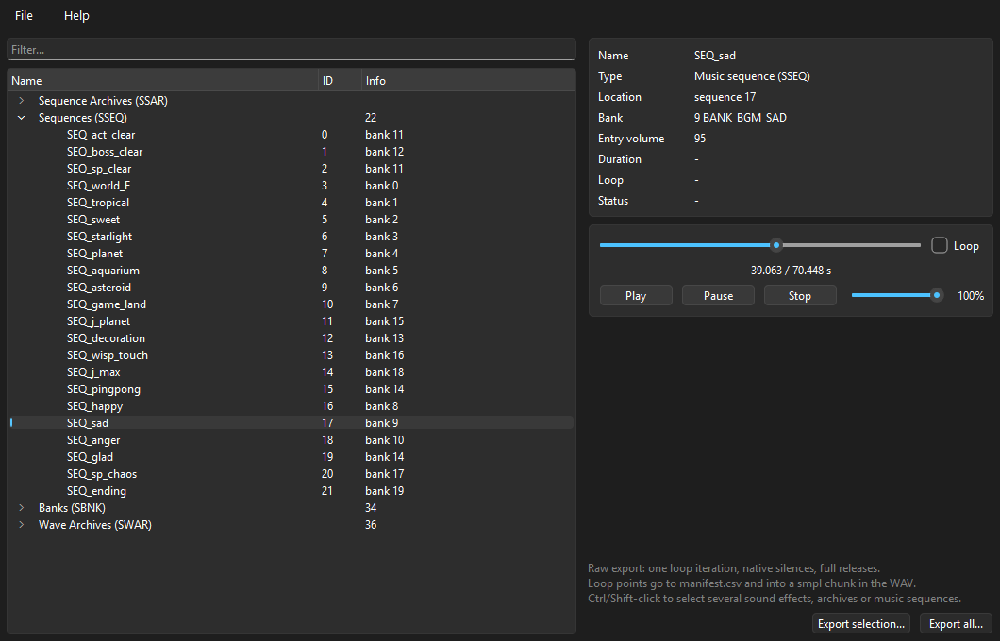

# DualRip

Rips Nintendo DS sound effects (SSAR) & music (SSEQ) from `sound_data.sdat`, and Nintendo 3DS sounds (CSEQ sequences, CWSD wave sounds, BCSTM streams) from CSAR archives, to WAV by emulating each console's sound driver. CLI + GUI.

## What you get

- One loop iteration per sound or song, full release envelopes, native rests preserved.
- Loop points in `manifest.csv` and embedded in the WAV as a `smpl` chunk.
- 3DS streams (BCSTM) decode bit-exact, sequences and wave sounds render through the same raw-export policy as NDS.

## Screenshots

Shown for DS; 3DS ROMs (`.cia`/`.3ds`) and `.bcsar` archives use the same picker/tree/preview/export.

Open a `.nds` ROM: pick one or more SDATs from the selection dialog (Ctrl/Shift-click for multiple):



Browse multiple SDATs side-by-side, grouped by archive:



Browse the SDAT, preview sound effects with the built-in player (seek, pause, loop on the sound's own loop points):



Music sequences with full-length seek bar and live playback:



Batch export with per-entry log, loop points and bank auto-resolution notes:


## Usage

```
dualrip --file sound_data.sdat --archive all --out MyRip
dualrip --file sound_data.sdat --sequence all --out MyMusic
dualrip --file game.nds --archive-index 0 --archive all --out MyRip
dualrip --file game.cia --folder all --out MyRip
dualrip --file game.3ds --list
```

| Option | Effect |
|---|---|
| `--file PATH` | path to a `.sdat`, a `.nds` ROM, a 3DS ROM (`.cia`/`.3ds`) or a `.bcsar` archive |
| `--archive-index N` | when `--file` holds several SDATs/CSARs, pick one (0 = first). Omit to list them. |
| `--archive N` | NDS: rip one SSAR archive, or `all` (default when no `--sequence`) |
| `--sequence N...` | NDS: rip these SSEQ music indices, or `all` (into an `SSEQ/` subfolder) |
| `--folder NAME...` | 3DS: rip these CSAR folders (see `--list`), or `all` (default) |
| `--list` | list archives/folders and exit without ripping |
| `--rate N` | sample rate (default 44100) |
| `--only I J...` | only these entry/sound indices |
| `--bank-map "4=32+33"` | NDS only: override bank resolution |

GUI: open a `.sdat`/`.nds` or a 3DS `.cia`/`.3ds`/`.bcsar`, browse/filter,
double-click to preview any sound effect or music track (seek, pause, loop
on its own loop points), Ctrl/Shift-select sound effects, archives,
sequences or 3DS folders and export. Files with several SDATs/CSARs let
you pick several at once via the selection dialog.

## Dynamic bank slots (NDS)

Some games leave bank slots null in the SDAT and fill them at runtime.
DualRip resolves these automatically (family-affinity + coverage ranking).
The resolution shows up in the manifest (`4->33`); `--bank-map` overrides.

3DS CBNK banks don't have this null-slot mechanism, but the same file can exist in several per-group variants

## Credits

Core is a Python port of the FeOS Sound System (fincs), via Naram Qashat's
NCSF player ([in_xsf](https://github.com/CyberBotX/in_xsf)). Tables from
Nintendo NNS driver disassembly. Adds two behaviors missing upstream:
note-wait on endless notes (voice chaining) and portamento sweep on tied notes.
The 3DS CSEQ renderer is a separate, self-contained implementation.

## Code

```
dualrip/formats/sdat/          SWAR/SWAV, SBNK, SDAT, NDS ROM extraction (parsing)
dualrip/formats/ctr/           CSAR/CSEQ/CBNK/CWAR/CWSD/BCSTM, 3DS ROM extraction (parsing)
dualrip/engine/sdat/           DS sequencer/channel/render, cprims + lookup tables
dualrip/engine/ctr/            3DS CSEQ sequencer/channel/render, cprims + LUTs
dualrip/bankmap.py             static patch scan + auto bank resolution
dualrip/export.py              WAV/manifest, public API: render_one / rip_archive / rip_sequences / rip_ctr_folder
dualrip/cli.py, gui/           frontends
```

Each console has a parsing half (`formats/<fmt>/`) and an engine half
(`engine/<fmt>/`), split the same way: `sdat` for DS, `ctr` for 3DS. Deps go
one way — parsing never imports its engine; the engine consumes parsed
structures passed in (banks, wave samples, a bank-lookup callback), so
`engine/*` never imports `formats/*`. `export.py` (DS) and the `CtrArchive`
facade (3DS) bridge the two halves. Nothing outside `gui/` imports Qt. Golden
tests in `tests/test_golden.py` (`DUALRIP_TEST_SDAT` for the DS half,
`DUALRIP_TEST_CTR` for the 3DS half) pin both renderers bit-for-bit.

## Requirements

Python ≥ 3.10, `numpy`, `ndspy`, `pyctr`, `PySide6`, `sounddevice`. Decrypted
`.cia`/`.3ds` files and loose `.bcsar` archives open with no extra requirement;
an encrypted ROM additionally needs the console's boot ROM dump (`boot9.bin`),
set in Settings (GUI) or passed with `--boot9` (CLI). No game data included.

## Build

```
pip install -e .[gui] pyinstaller
pyinstaller dualrip.spec          # dualrip_linux.spec / dualrip_macos.spec elsewhere
```

One-file build, bundles Python, PySide6 and the icon. `build_exe.bat` /
`build_linux.sh` / `build_macos.sh` wrap the same command per platform.
Linux needs `libportaudio2` and the Qt xcb libs installed on the build
machine (see the `apt-get` step in `.github/workflows/release.yml`).
Pre-built binaries for Windows, Linux and macOS are available on the releases page.
